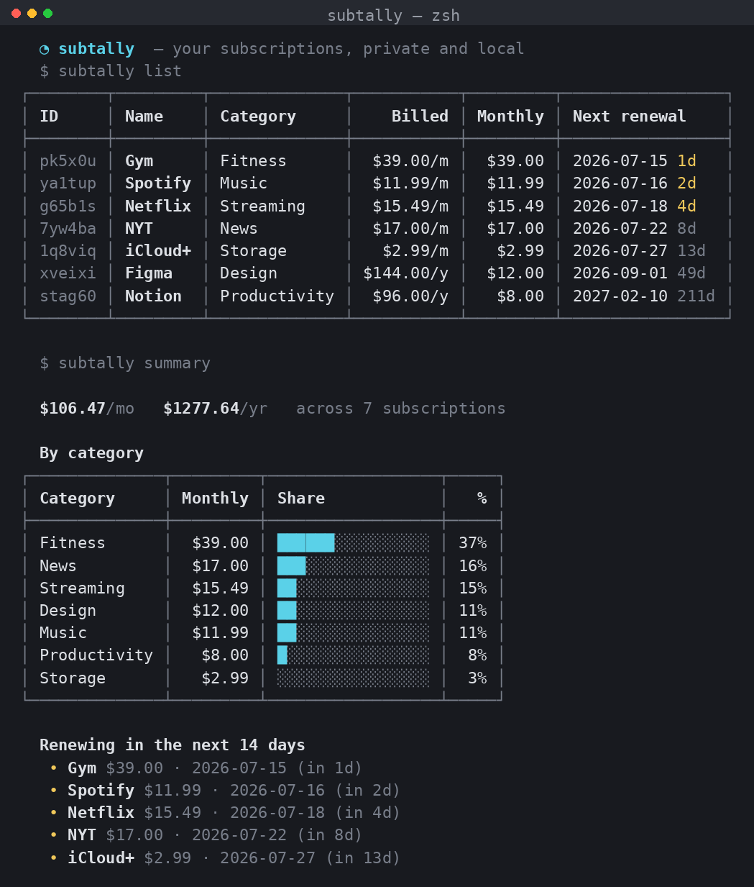

<p align="center">
  
</p>

<h1 align="center">cardpine</h1>

<p align="center"><em>Spaced-repetition flashcards for your terminal.</em></p>

<p align="center">
  
</p>

---

## What it is

cardpine is a small, fast flashcard tool that lives in your terminal. Write
your cards in a plain text file, run one command, and it schedules each card
using the proven **SM-2** spaced-repetition algorithm — the same family of
math behind the big study apps, minus the accounts, subscriptions, and sync
prompts.

Your decks are just text files you own. Your progress is a small JSON file
that sits right next to them. Nothing leaves your machine.

## Who it's for

- **Students** cramming vocabulary, formulas, dates, or definitions.
- **Language learners** who want a frictionless daily review habit.
- **Developers** memorizing shortcuts, commands, or interview material.
- Anyone who lives in a terminal and would rather not open a browser to study.

## Install

cardpine is pure Python (3.8+) with **zero dependencies**.

```bash
git clone https://github.com/brod-dev/cardpine.git
cd cardpine
pip install -e .
```

That gives you a `cardpine` command. Prefer not to install? Run it straight
from the folder with `python3 -m cardpine`.

## Use it

Write a deck. Cards are separated by a blank line; the front and back are
split by a line containing only `===`:

```text
# Spanish Basics

Good morning
===
Buenos días

Thank you
===
Gracias
```

Then study:

```bash
cardpine review examples/spanish-basics.txt   # review everything due today
cardpine stats  examples/spanish-basics.txt   # see progress and what's next
cardpine list   examples/spanish-basics.txt   # list every card in the deck
```

During a review you'll see the front of each card. Press **Enter** to reveal
the answer, then grade how it went:

| Key | Meaning | Effect |
| --- | --- | --- |
| `1` | Again | You blanked — the card comes back today |
| `2` | Hard | Right, but a struggle |
| `3` | Good | Solid recall (Enter picks this) |
| `4` | Easy | Effortless — pushed further out |

cardpine spaces each card out further every time you get it right, and pulls
it back in the moment you slip. Review a few minutes a day and the schedule
does the rest.

## Features

- **SM-2 scheduling** with per-card easiness, intervals, and streaks.
- **Plain-text decks** you can edit anywhere and keep in version control.
- **Content-hashed cards** — reorder or add cards without losing history.
- **Local-first**: no accounts, no network, no telemetry.
- **Polished terminal UI** with clear cards, colors, and keyboard grading.
- **Progress at a glance**: due today, new, learned, and what's coming up.
- **Zero dependencies** and a tiny, readable codebase.

## Deck format in full

- A leading `# Heading` line before any card sets the deck title.
- `// ...` lines are comments and are ignored.
- Front or back can span multiple lines.
- Malformed blocks are skipped rather than guessed at.

## Development

```bash
python3 -m unittest discover -s tests   # run the test suite
```

## License

MIT — see [LICENSE](LICENSE).
